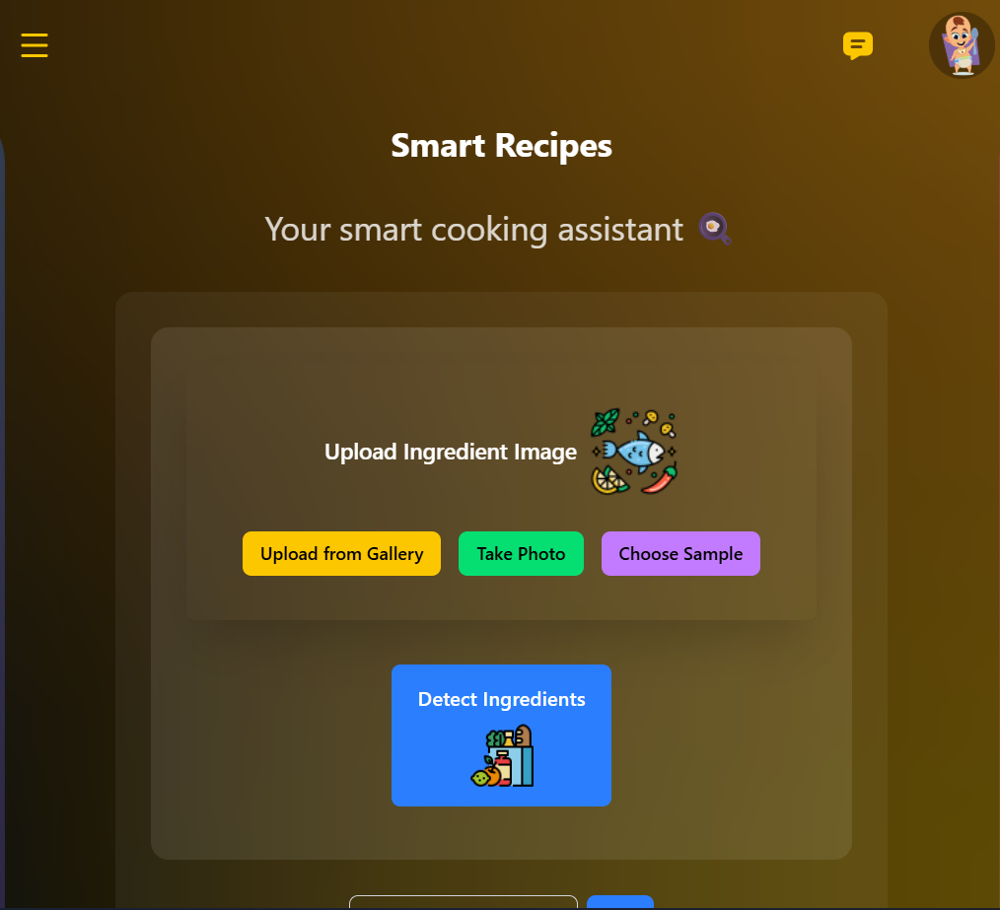

# 🍲 Recipe Detection App

**Detect ingredients from images and get recipes instantly using AI!**  

  

## Overview
This app allows users to:  
- Upload an image of ingredients or choose from **sample images**.  
- Detect ingredients automatically using AI.  
- Add ingredients manually if needed.  
- Get recipe suggestions based on detected ingredients.  

It is **responsive, interactive, and visually appealing**, built with React and modern UI design principles.  

---

## Features
- ✅ Upload ingredient images or capture via camera.  
- ✅ Choose from predefined sample images with preloaded ingredients.  
- ✅ AI-powered ingredient detection (via backend).  
- ✅ Manual ingredient input for customization.  
- ✅ Clean and modern UI with glassmorphism and responsive design.  
- ✅ Interactive footer with social links.  

---

## Demo
>  Hosted on https://recipe-frontend-chi-sandy.vercel.app/  

---

## Technologies Used
- **Frontend:** React, Tailwind CSS, Lucide Icons  
- **Backend:** Node.js / Express / FastAPI (for secure API calls)  
- **AI Integration:** Google GenAI (via secure backend)  
- **Image Handling:** Browser File API, Camera API, Sample images  
- **Styling:** Glassmorphism, gradients, responsive design  

---
